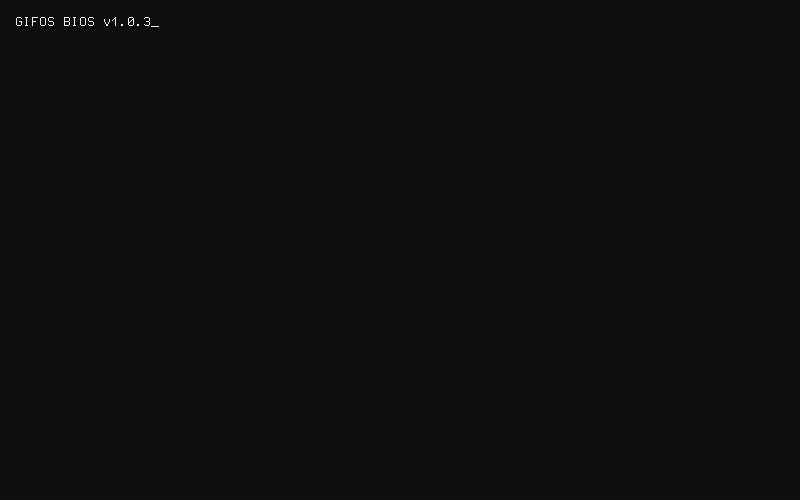

<!-- Retro Terminal Hero - auto-updated via GitHub Actions -->

 

---

### 🛠️ Tech Stack

**Frontend**

**Backend**

**Infra & Database**

**Tools**

---

### 📊 GitHub Stats

 

 

---

### 🏆 GitHub Trophies

---

### 📬 Connect With Me

 

